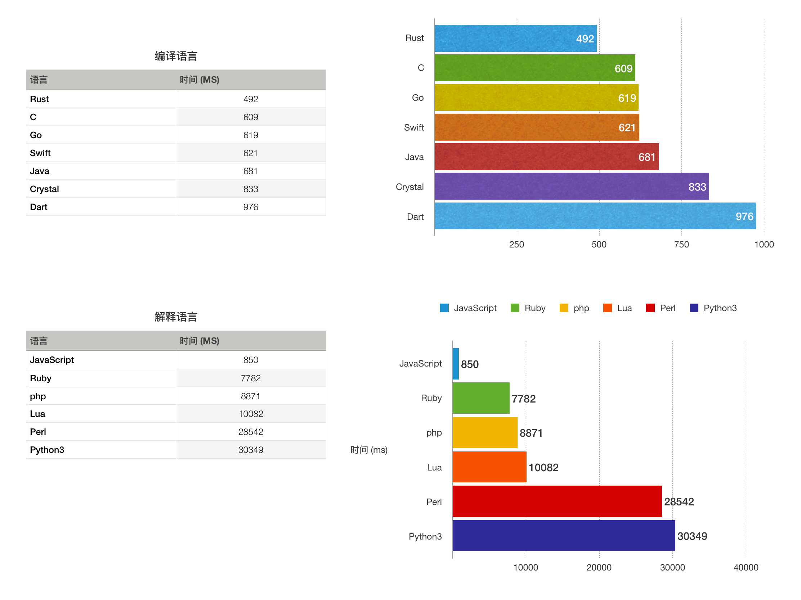

# Hello, Prme

自从1978年的`The C Programming Language`开始，了解门程序语言都是从Hello world开始。  
可能涉及的语言： [Github Language Stats](https://madnight.github.io/githut/#/pull_requests/2019/4) 。  

## 约定

计算第 `300000`个素数的值：答案是 `4256233`。尽量使用语言自带的时间计算函数统计计算消耗的时间：  
测试计算机：  `Intel Core i7-8700 @  4.30 GHz` .  


* 编译型语言使用`release`版本，由于数据类型对性能的影响还是比较大的，可以指定的都使用`uint32`。
* 在`Swift`和`go`等语言中，代码第五行的`j > i/j`性能比`j * j > i`好20%（而且这俩语言不约而同的20%??），大部分语言都是后者更好，C语言甚至后者比前者快一倍，我会分别测试，选择最好的结果。

```go
func nthPrime(n int) int {
	i, j := 3, 1
	for {
		j = j + 2
		if j > i/j {
			n--
			if n == 1 {
				return i
			}
			i, j = i+2, 1
		} else if i%j == 0 {
			i, j = i+2, 1
		}
	}
}

func main() {
	t1 := time.Now()
	n := 300000
	result := nthPrime(n)
	t2 := time.Since(t1)
	fmt.Printf("答案是:%d,耗时:%s\n", result, t2)
}
```

```shell
❯ go version
go version go1.13.7 darwin/amd64
❯ ./go
答案是:4256233,耗时:2.815581095s
```

## TL;DR


